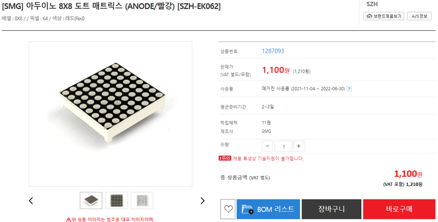
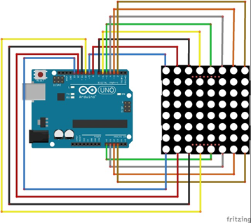
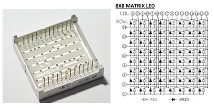
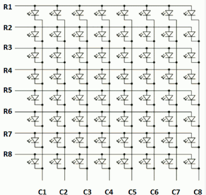
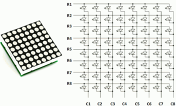

# 도트 매트릭스 LED

## 실습 부품 준비하기

쇼핑몰에서 다음과 같이 부품을 구매하여 실습을 준비합니다.

## 도트 매트릭스란?

여러개의 LED들을 격자모양으로 서로 배치하여 연결된 것을 말합니다.

격자모양으로 연결하여 묶어 놓은 이유는 도트매트릭스를 동작시키기 위한 `핀의 숫자를 줄이기 위해`서 입니다.

## 8X8 매트릭스

8X8 매트릭스의 LED는 각각의 LED 픽셀당 1개씩 64개의 I/O핀이 필요합니다.

모든 양극을 행으로 함께 묶고(R1-RB), 모든 음극을 열로 열로 함께 묶으면(C1-C8) 필요한 I/O핀은 16개로 줄어 듭니다.

각각의 LED픽셀은 행과 열 조합으로 접근할수 있습니다.

## 셀 LED 켜기

R4를 HIGH로 C3를 LOW로 만들었을 때 (4, 3) 위치에 있는 LED가 ON됩니다.

## 잔상효과

각각의 행에서 한개의 핀은 한번에 오직 한개의 LED에만 전류를 공급할수 있습니다만 열에 있는 핀은 한개 이상의 LED의 전류 sink입니다.

1초에 100번이상의 속도로 각 행을 빠르게 스캐닝하면서 각각의 행에 있는 해당 LED를 ON 시키면, 눈에 의한 잔상효과로 인해 우리는 하나의 이미지 인식하게 됩니다.
