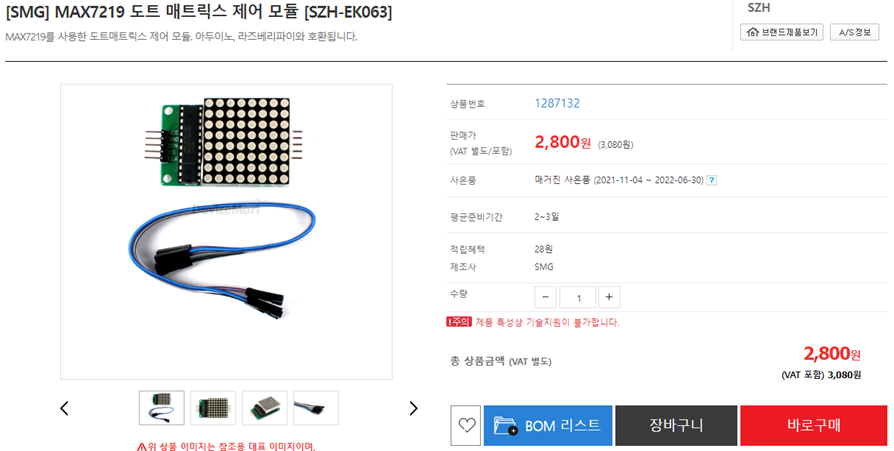
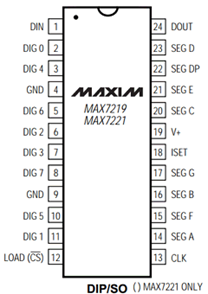
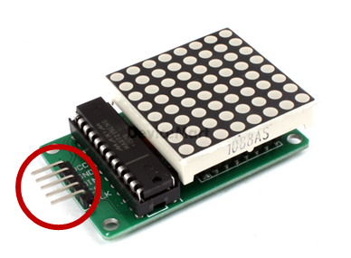
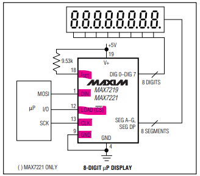
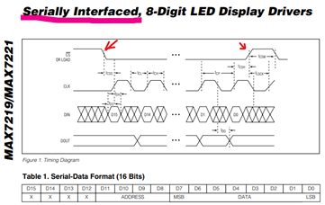
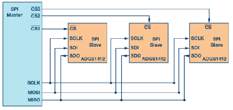

# MAX7219 드라이브

## 실습 준비하기

## Max 7219 

MAX7219 칩은 dot Metrix 를 보다 쉽게 구동할 수 있도록 도와주는 IC 입니다.

Vcc, Gnd, Din, CS, CLK 5개 핀으로 64개의 LED를 제어할 수 있습니다.

## SPI 통신

MAX7219는 SPI 통신으로 시리얼 데이터를 주고 받습니다.

## 멀티 체인

SPI는 Daisy-Chain 방법을 통하여 여러 개의 장비를 Master-Slave 형태로 연결할 수 있습니다.

