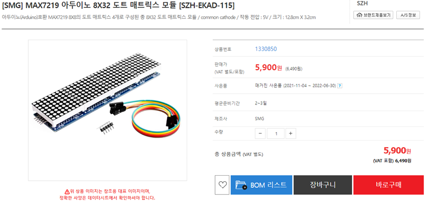
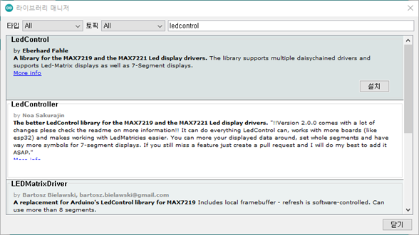
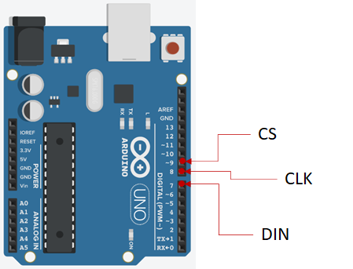
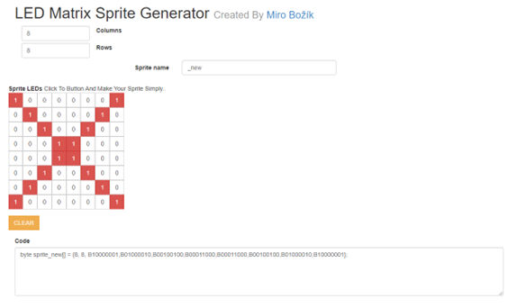

# 모듈 확장


## 실습 준비




## 라이브러리 설치




## 코드실행:초기화


```
#include "LedControl.h" 
LedControl dot_matrix=LedControl(7,8,9,   4); 
// 도트 매트릭스 제어 객체 선언

// DIN 핀을 7번에 CLK 핀을 8번에 CS핀을 9번에 연결
// (DIN, CLK, CS, 연결할 도트 매트릭스의 개수)
```




## 문자 출력하기

비트맵 문자를 만들어 Dot Metrix LED에 출력해 보도록 합니다.


https://embed.plnkr.co/3VUsekP3jC5xwSIQDVHx  에 접속하면 보다 쉽게 Dot 문자를 편집할 수 있습니다.





예제코드: /03/metrix_01

```
#include "LedControl.h" 

// step1 : 매트릭스 설정
const int DIN=7; // DIN 핀을 7번
const int CS=8;  // CS핀을 8번
const int CLK=9; // CLK 핀을 9번에 
const int MATRIX=4; // (DIN, CLK, CS, 연결할 도트 매트릭스의 개수)

// 도트 매트릭스 제어 객체 선언
LedControl dot_matrix=LedControl(DIN,CS,CLK, MATRIX); 


// step2
// 출력데이터 생성
// http://embed.plnkr.co/3VUsekP3jC5xwSIQDVHx 를 참조
int n_matrix = 4;

// 이진수 배열로 선언
byte mat4[8]={B00110010,B01001010,B01001011,B01001010,B00110010,B00000000,B01000000,B01111110};
byte mat3[8]={B01000010,B01000110,B01000010,B01110110,B00000010,B00111100,B01000010,B00111100};
byte mat2[8]={B00100100,B01110100,B00000100,B00100111,B01010100,B01010100,B00100100,B00000100};
byte mat1[8]={B00110010,B01001010,B01001010,B01001010,B01001010,B01001010,B01001010,B00110010};


void setup(){
 for(int i=0; i<n_matrix; i++) // 매트릭스 0번부터 3번까지 세팅
  {
   dot_matrix.shutdown(i,false); // 0~3번까지 매트릭스 절전모드 해제
   dot_matrix.setIntensity(i,8); // 매트릭스의 밝기 0-15 사이의 정수
   dot_matrix.clearDisplay(i); // 매트릭스를 초기화
  }
}


void loop() {
  // mat1, mat2, mat3, mat4를 도트 매트릭스에 출력
  turn_on_led(mat1, mat2, mat3, mat4, dot_matrix);  
  delay(1000);

  // 4개의 매트릭스 led 초기화
  for(int i=0; i<4; i++){ 
    dot_matrix.clearDisplay(i);
  }
  delay(1000);

}


// led를 켜는 함수
void turn_on_led(byte* mat1, byte* mat2, byte* mat3, byte* mat4, LedControl lc){ 
 for(int ii=0; ii<8; ii++)
 {
   lc.setRow(0, ii, mat1[ii]); // 0번째 매트릭스에 mat1 출력
   lc.setRow(1, ii, mat2[ii]); // 1번째 매트릭스에 mat2 출력
   lc.setRow(2, ii, mat3[ii]); // 2번째 매트릭스에 mat3 출력
   lc.setRow(3, ii, mat4[ii]); // 3번째 매트릭스에 mat4 출력
 }
}

```


## 각자 LED 제어 데모동작

예제코드: /03/metrix_02


```
#include "LedControl.h" 

// step1 : 매트릭스 설정
const int DIN=7; // DIN 핀을 7번
const int CS=8;  // CS핀을 8번
const int CLK=9; // CLK 핀을 9번에 
const int MATRIX=4; // (DIN, CLK, CS, 연결할 도트 매트릭스의 개수)

// 도트 매트릭스 제어 객체 선언
LedControl dot_matrix=LedControl(DIN,CS,CLK, MATRIX); 

int n_matrix = 4;

void setup(){
 for(int i=0; i<n_matrix; i++) // 매트릭스 0번부터 3번까지 세팅
  {
   dot_matrix.shutdown(i,false); // 0~3번까지 매트릭스 절전모드 해제
   dot_matrix.setIntensity(i,8); // 매트릭스의 밝기 0-15 사이의 정수
   dot_matrix.clearDisplay(i); // 매트릭스를 초기화
  }
}

void loop(){
//데모1  점점 채우기
  for(int k=0;k<4;k++){
    for(int i=0; i<8;i++){
      dot_matrix.setRow(k,i,B11111111);
      delay(100);
    }
     dot_matrix.clearDisplay(k);
  }

  for(int k=3;k>0;k--){
    for(int i=8; i>0;i--){
      dot_matrix.setRow(k,i,B11111111);
      delay(100);
    }
     dot_matrix.clearDisplay(k);
  }


// 데모2
for(int k=0;k<4;k++){
    for(int j=1;j<255;){
      // 세로줄
      for(int i=0; i<8;i++){
        dot_matrix.setRow(k,i,j);
      }
      j = j*2;
      delay(100);
      dot_matrix.clearDisplay(k);    
    }        
  }

  for(int k=3;k>0;k--){
    for(int j=0x40;j>0;){
      // 세로줄
      for(int i=0; i<8;i++){
        dot_matrix.setRow(k,i,j);
      }
      j = j/2;
      delay(100);
      dot_matrix.clearDisplay(k);
    }
  }  
  
  // 데모3
  for(int k=0;k<4;k++){
    for(int i=0; i<8;i++){
      dot_matrix.setRow(k,i,B11111111);
      delay(100);
      dot_matrix.clearDisplay(k);
    }     
  }

  for(int k=3;k>0;k--){
    for(int i=8; i>0;i--){
      dot_matrix.setRow(k,i,B11111111);
      delay(100);
      dot_matrix.clearDisplay(k);
    }     
  }
}
```

