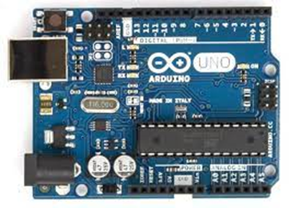

# 아두이노 소개
아두이노를 통하여 코딩 입문을 위한 강의 자료 입니다.   

## 아두이노 맞보기
USB 케이블을 이용하여 컴퓨터와 연결해 봅니다.  

– 아두이노의 **LED** **램프가 깜빡이**는 것을 확인해 볼 수 있습니다.  

① 노트북의 **전원**이 USB 케이블을 통하여 아두이노에 전달됩니다.
② 아두이노에 내장된 Blank **프로그램**이 동작합니다.

#### 아두이노는 아주 작은 컴퓨터 입니다. 
AVR 마이크로프로세스를 이용하여 주변의 회로를 제어합니다. 아두이노를 잘 사용하기 위해서는 기초적인 전기,전자 지식이 필요합니다.

#### 아두이노는 컴퓨터 프로그램을 기반으로 동작합니다.
아두이노는 작은 컴퓨터로 프로그램에 의해서 **주변의 회로 로직을 제어**하게 됩니다. 아두이노를 동작하기 위해서는 PC 컴퓨터에서 **프로그램을 작성**하고 이를 다시 아두이노로 전송을 해야 합니다.

## 강의 내용 살펴보기
이제 `아두이노`에 대해서 차근차근 알아보도록 합시다. [ppt](https://drive.google.com/drive/folders/1PD4h8bJ93fvDd_NIMG403xOHJgN40ao-?usp=sharing)

1. 기본실습
2. 출력실습
3. [디스플레이](./display)
    - 세븐 세그먼트
    - [LCD](./display/lcd)
    - [Dot Metrix LED](./display/metrix)
4. 입력실습
5. 모터실습
6. 모터구동
7. 모터제어
8. 입출력
9. 통신
10. 앱인벤터 연동
11. 아두이노 메가

## 예제코드
본 강좌의 모든 코드는 [깃허브](https://www.github.com/infohojin/arduino) 에 공개되어 있습니다. 또한, 누구나 포크하여 다양한 예제코드를 생성, pull-request 를 요청할 수 있습니다. 깃에 대하 사용법이 익숙하지 않다면 [깃교과서](https://git.jiny.dev)를 참고하여 학습할 수 있습니다.
