# 블루투스 연결


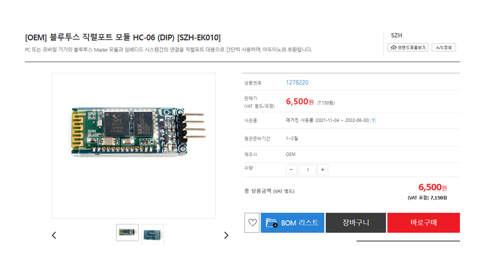


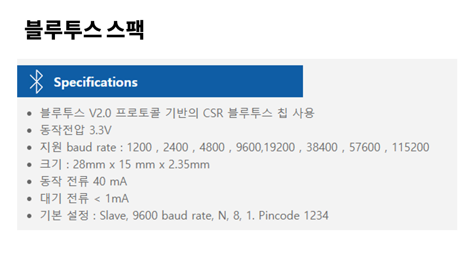


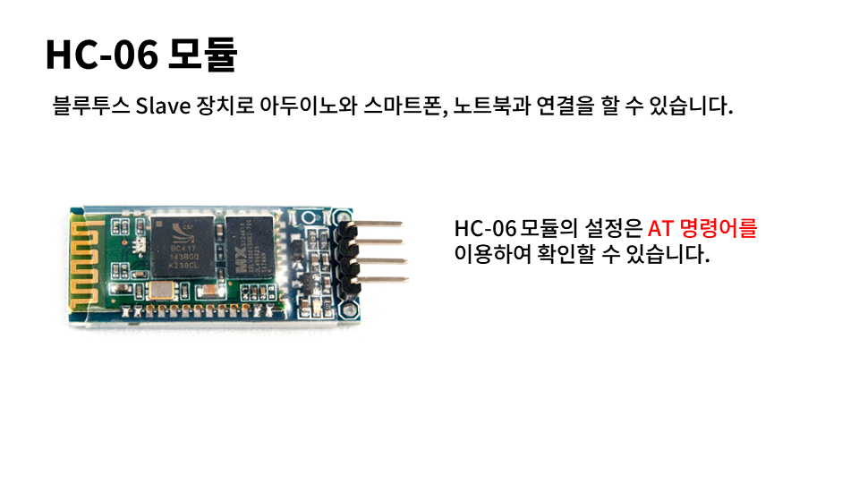


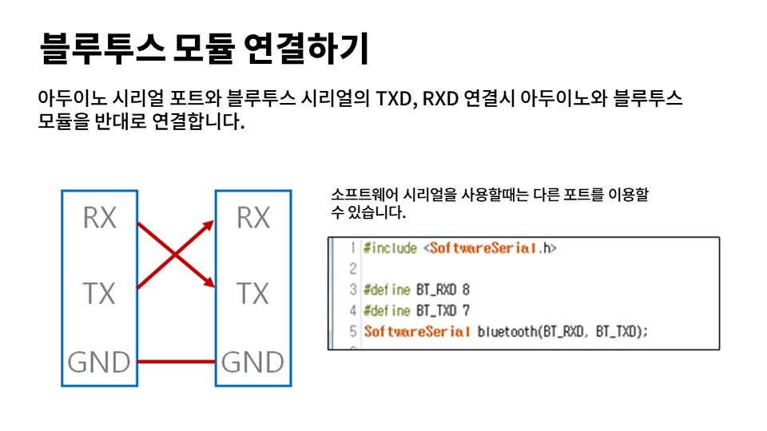


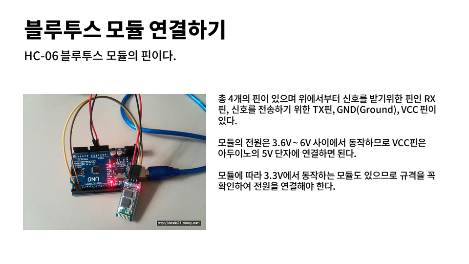


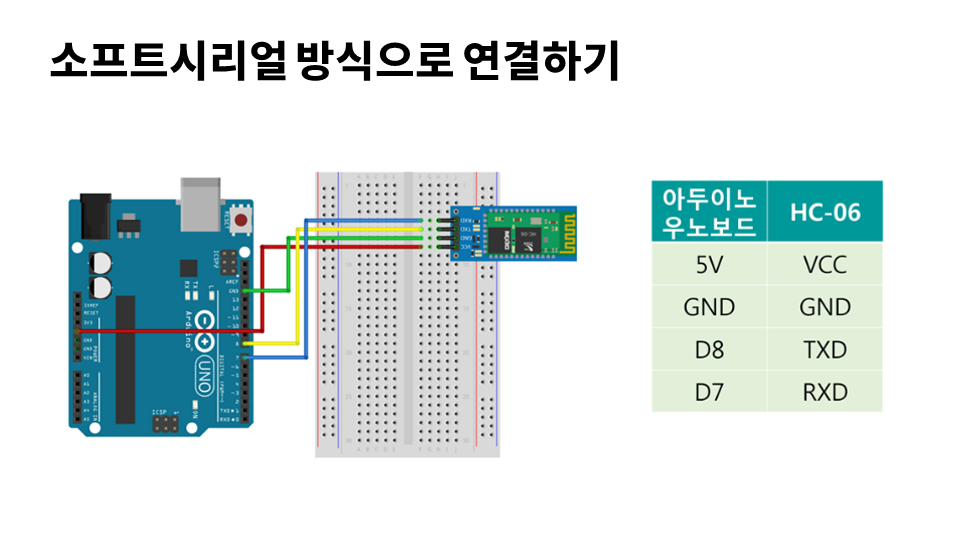

## 소프트웨어 시리얼

아두이노의 HW 시리얼과 충돌을 방지하고, 외부의 블루투스 연결하기 위하여 가상의 시리얼 통신 규약을 처리할 수 있는 소프트웨어 시리얼을 사용합니다.


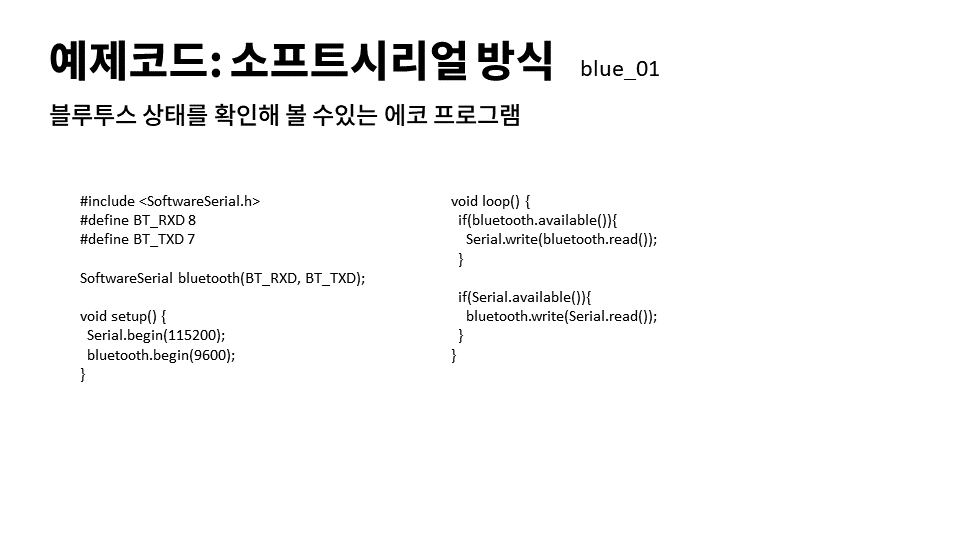

**Step1:** 소프트웨어 시리얼을 사용하기 위해서는 외부 라이브러리를 사용해야 합니다. 소스코드에 해더파일을 삽입합니다.

```
#include <SoftwareSerial.h>
```


**Step2:**  블루투스 연결하는 핀을 정의 합니다. 본 예제에서는 `8번핀`과 `7번핀`을 사용합니다.

 ```
 #define BT_RXD 8
 #define BT_TXD 7
 ```


**Step3:** 소프트웨어 시리얼을 통하여 블루투스를 초기화 합니다.

```
SoftwareSerial bluetooth(BT_RXD, BT_TXD);
```


**Step4:** 초기화, setup에서 블루투스와 시리얼모니터 데이터 속도를 초기화 합니다.

```
void setup() {
  Serial.begin(9600); // 시리얼 모니터
  bluetooth.begin(9600); // 블루투스 모듈
}
```

> 블루투스 모듈의 초기 기본값은 `9600` 입니다. 


**Step5:** 동작구현부, loop 동작에서 시리얼 모니터와 블루투스 기기간의 echo 통신을 합니다.

```
void loop() {
	// 블루투스에서 데이터를 값이 있는지 확인 합니다.
	if(bluetooth.available()){
		// 블루투스에서 읽은 값을, 시리얼 모니터에 출력합니다.
    	Serial.write(bluetooth.read());
    }
  
  	// 시리얼 모니터에서 값을 확인합니다.
  	if(Serial.available()){
  		// 시리얼 모니터의 값을, 블루투스로 전송합니다. 
    	bluetooth.write(Serial.read());
  	}
  	
  	// 다시 처음 loop로 돌아가면서, 이 동작을 반복합니다.
}
```


전체코드는 다음과 같습니다.


**전체 코드:** bluetooth_01.ino

```c
#include <SoftwareSerial.h>
#define BT_RXD 8
#define BT_TXD 7

SoftwareSerial bluetooth(BT_RXD, BT_TXD);

void setup() {
  Serial.begin(115200);
  bluetooth.begin(9600);
}

void loop() {
  if(bluetooth.available()){
    Serial.write(bluetooth.read());
  }
  
  if(Serial.available()){
    bluetooth.write(Serial.read());
  }
}
```


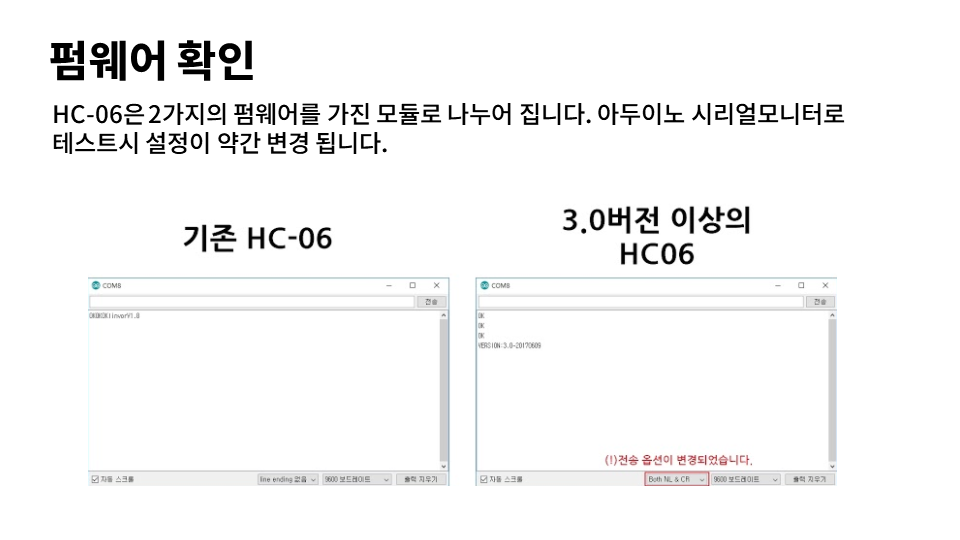

> 시리얼 모니터가 출력되기 위해서는, 아두이노가 연결되어야 합니다.

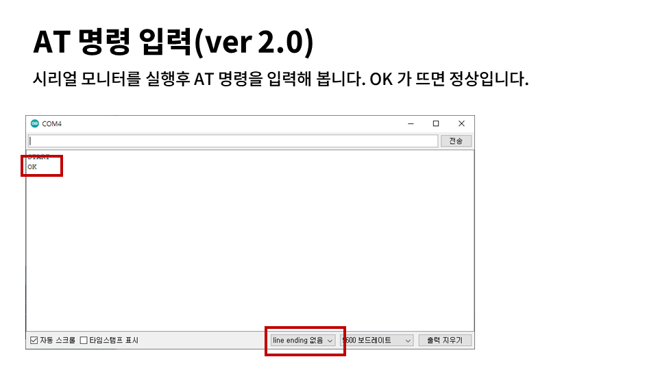
아두이노 통합 IDE `시리얼 모니터`창에서 `AT`명령을 입력해 봅니다. 시리얼창 화면에 `OK`가 출력되면 정상입니다. 

> AT명령을 입력할때에는, 블루투스 모듈의 LED가 깜빡거리는 상태이어야 합니다. 


**동작설명1:**

앞에서 작성한 bluetooth_01 코드에서 보면 `A` 를 아두이노에게 보내고, 이를 다시 블루투스로 `A`문자를 전송합니다. 그리고 2번째 `B`문자가 시리얼로 입력되면, 다시 블루투스로 `B`문자가 전송됩니다.


**동작설명2:**

`AT`명령을 입력받은 블루투스는 `OK`문자열을 반환하게 됩니다. 아두이노 프로그램은 블루투스로 전송받은 `O`와 `K`를 다시 시리얼 모니터로 반환하여 출력하게 됩니다. 


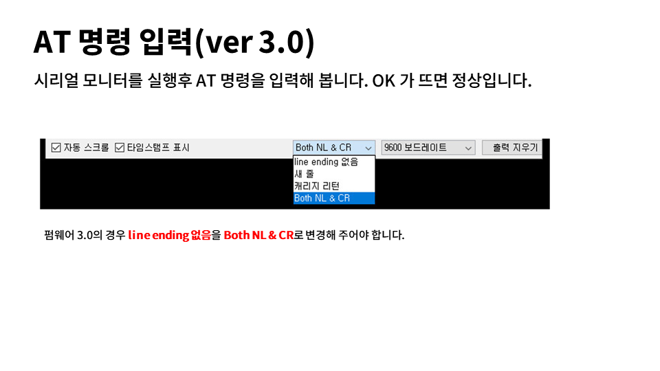
시리얼 모니터화면에 `OK`가 출력되지 않으면, 블루투스 모듈의 버젼을 확인합니다. 버젼에 3,0인 경우에는 시리얼 모니터의 설정을 `Both NL & CR`로 변경해 주셔야 합니다.

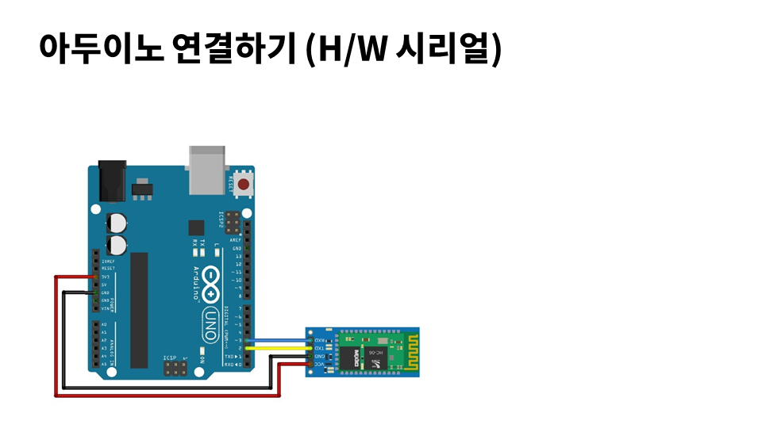

