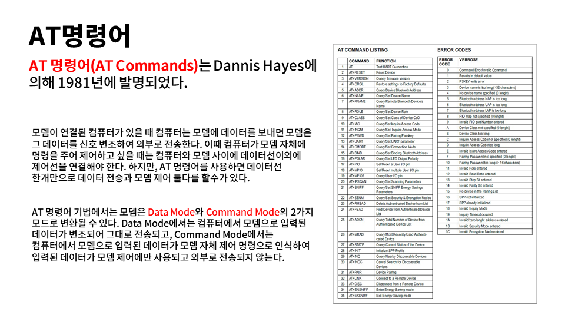
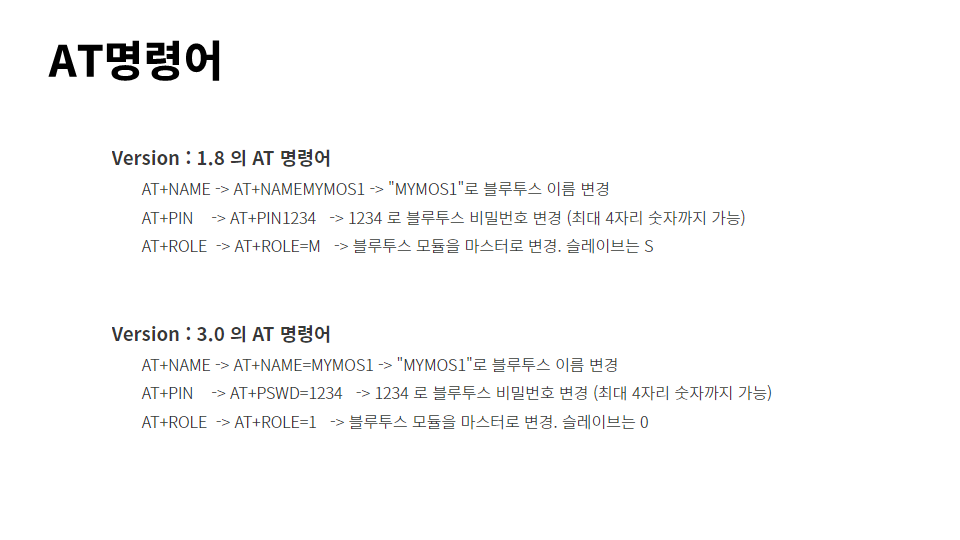
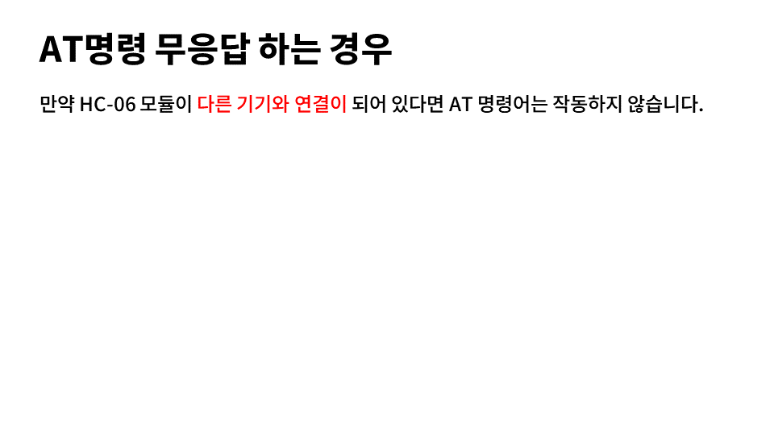
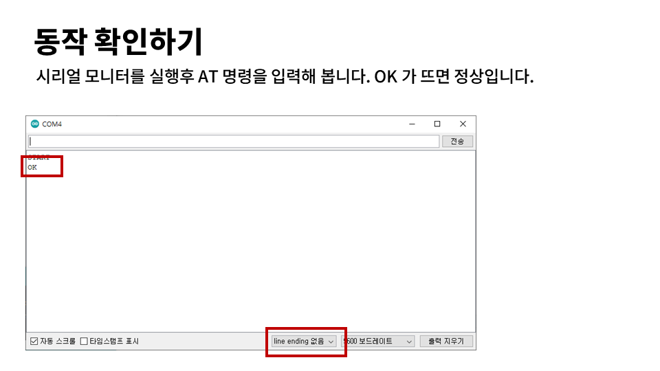
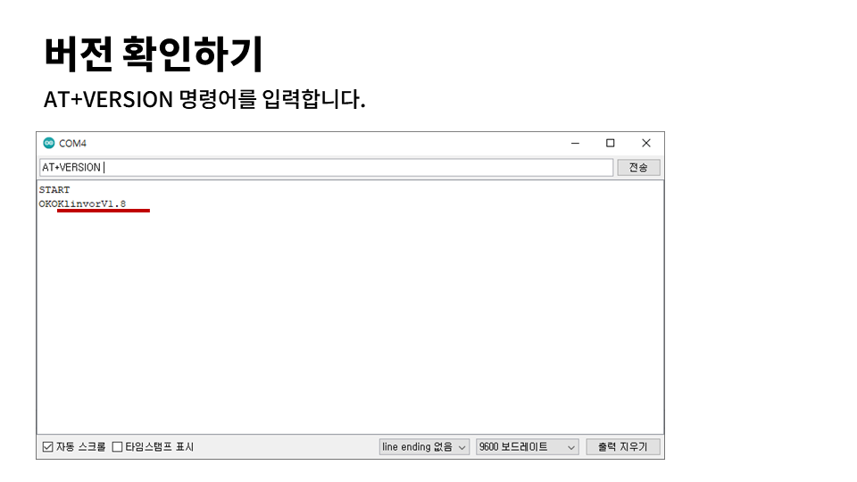
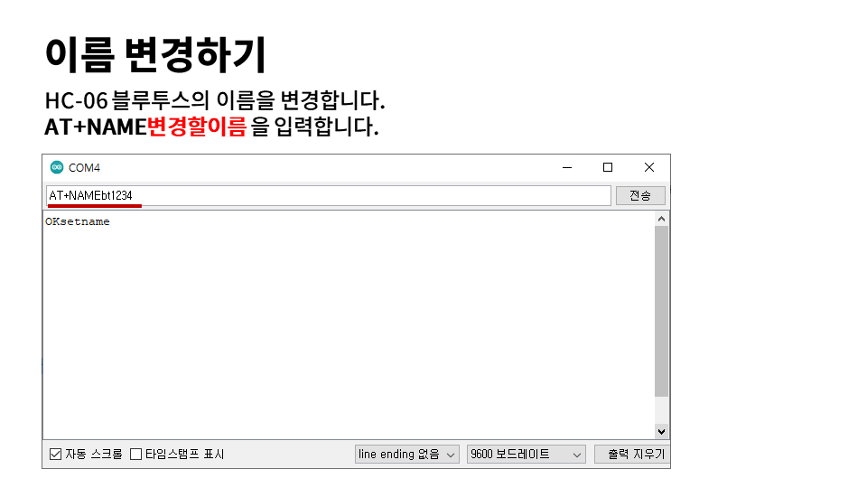
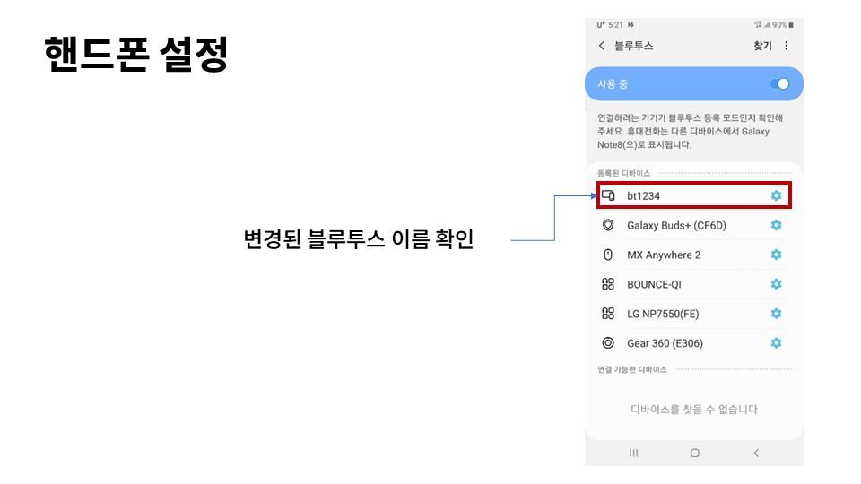
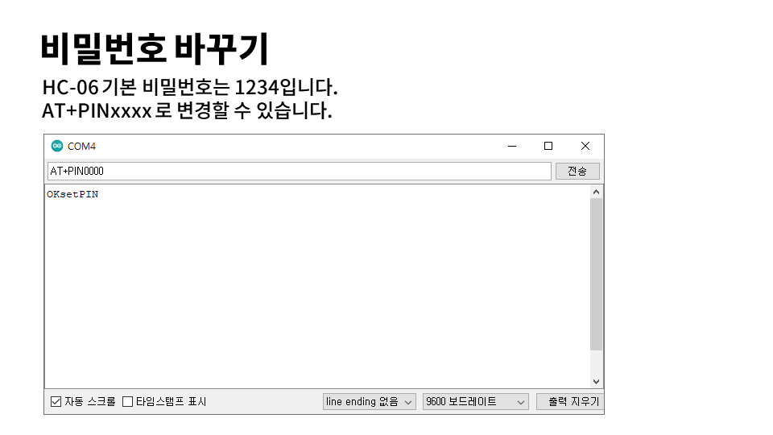

# AT명령
















### 버젼확인 

```
AT+VERSION
```


### 블루투스 이름 변경하기



시리얼 모니터를 통하여 블루투스에 새로운 이름을 지정합니다.

```
AT+NAME블루투스이름
```



블루투스 연결 페어링이 되면, HC-06 모듈의 LED 깜빡이가 사라지게 됩니다. LED가 항상 켜져 있으면, 블루투스가 핸드폰과 연결이 되어 있는 상태를 의미합니다.




